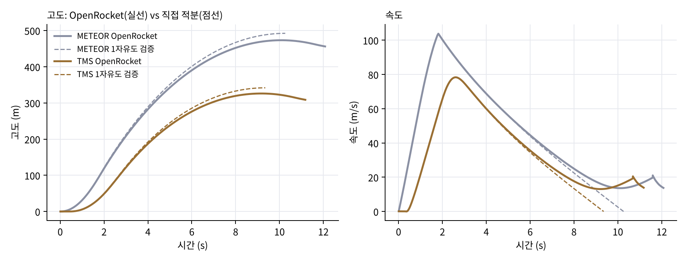
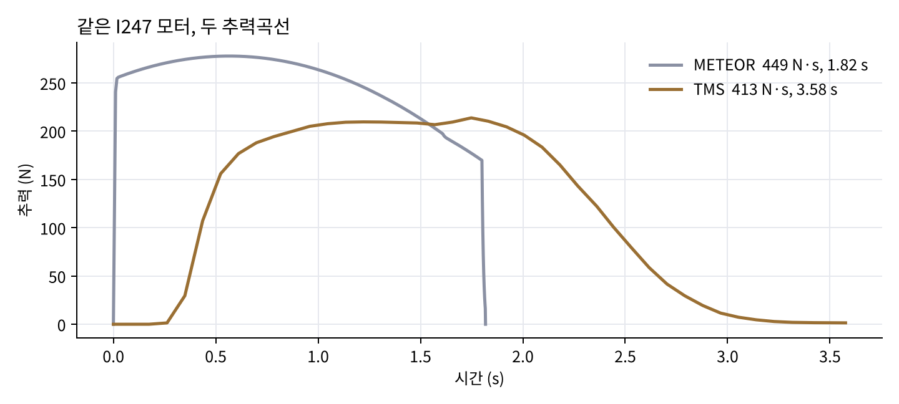
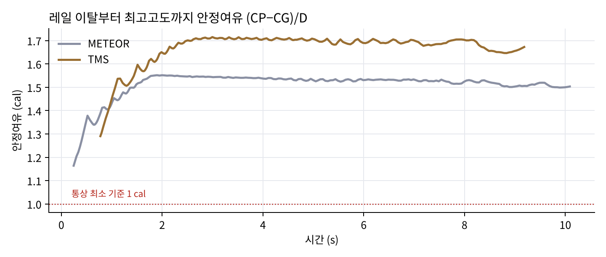
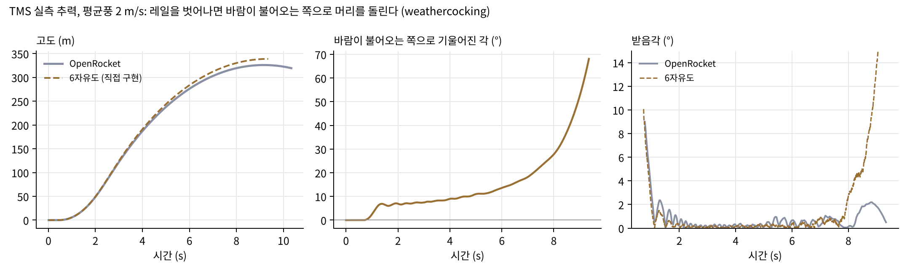
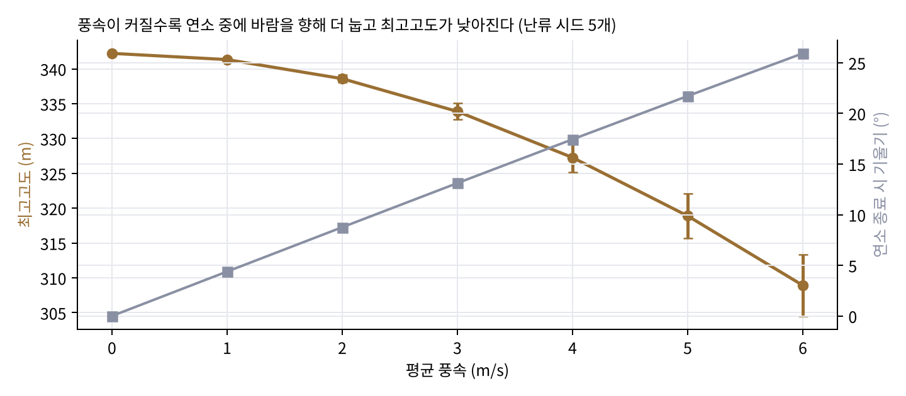

# AJR-2 로켓 — OpenRocket 설계·시뮬레이션과 독립 검증

아주대학교 로켓 동아리 **AJR-2** 로켓의 OpenRocket 설계 파일, 추력곡선, 시뮬레이션 결과 원본과, 그 결과를 직접 다시 계산해 확인한 분석 코드입니다.



## 무엇이 들어 있나

| 폴더 | 내용 | 비고 |
|---|---|---|
| `openrocket/AJR2.ork` | 로켓 설계 원본 (OpenRocket 23.09, designer KSW) | **원본 그대로** |
| `openrocket/sim_meteor.csv`, `sim_tms.csv` | 두 추력곡선으로 돌린 OpenRocket 비행 시뮬레이션 내보내기 | **원본 그대로** |
| `motors/TMS.eng` | I247 모터 **로드셀 실측** 추력곡선 (RASP 형식) | **원본 그대로** |
| `motors/METEOR.eng` | 같은 모터의 비교용 추력곡선 | **원본 그대로** |
| `analysis/rocket_analysis.py` | 설계·결과 분석과 1자유도 독립 검증 | 2026.10 작성 |
| `analysis/sixdof.py` | 실측 추력·바람을 넣은 6자유도 비행 시뮬레이터 | 2026.10 작성 |
| `figures/`, `results*.json`, `bom.csv` | 위 스크립트가 만든 그림·수치·부품 목록 | 자동 생성 |

## 설계

| 항목 | 값 |
|---|---|
| 동체 지름 | 131 mm (지관 동체, 상·하단 2분할) |
| 노즈콘 | 타원형, 길이 200 mm, PLA 3D 프린팅 |
| 핀 | 사다리꼴 4장, 루트 110 mm · 팁 49 mm · 높이 180 mm · 후퇴 61 mm, PETG 3D 프린팅 |
| 모터 | I247 (지름 50 mm, 길이 307 mm, 추진제 0.4 kg), 알루미늄 연소실 |
| 탑재 | 배터리·전장 베이, GPS + Pixhawk, 서보, 사출 장치 |
| 회수 | 지름 0.75 m 낙하산, 최고점 사출 |

부품별 질량은 [`bom.csv`](bom.csv)에 있습니다.

## 두 추력곡선 비교

대회에서 실제로 쓰는 연료·노즐을 로드셀에 연결해 추력을 직접 측정했고(**TMS 곡선**), 이 실측 곡선을 시뮬레이션에 넣었습니다. METEOR 곡선은 비교용입니다.



| | METEOR | TMS |
|---|---:|---:|
| 총역량 | 449 N·s | 413 N·s |
| 연소시간 | 1.82 s | 3.58 s |
| 평균 / 최대 추력 | 247 / 278 N | 115 / 214 N |

실측 곡선은 점화 후 약 0.26 s 동안 추력이 거의 없다가 천천히 올라가고, 연소가 두 배 가까이 길게 이어집니다. 총역량도 8 % 낮습니다. 질량(3,896 g)·항력계수(0.55)를 똑같이 두고 곡선만 바꿔 1자유도로 계산하면, 비교용 곡선은 최고고도를 402 m(실측 342 m, **+18 %**), 레일 이탈 속도를 14.6 m/s(실측 11.4 m/s)로 예측합니다. 실측 없이 비교용 곡선만 썼다면 성능을 크게 과대평가했을 것입니다.

## OpenRocket 결과

| | METEOR | TMS |
|---|---:|---:|
| 이륙 질량 | 3,708 g | 3,896 g |
| 최고고도 | **473 m** (10.1 s) | **326 m** (9.2 s) |
| 최대 속도 | 103.8 m/s | 78.4 m/s |
| 최대 가속도 | 67.3 m/s² | 45.3 m/s² |
| 레일(1 m) 이탈 속도 | 13.7 m/s | 11.4 m/s |
| 최소 안정여유 (레일 이탈 후) | 1.16 cal | 1.29 cal |
| 상승 중 평균 항력계수 | 0.34 | 0.55 |



두 시뮬레이션은 추력곡선 외에 이륙 질량(+188 g)과 항력계수도 다릅니다. 그래서 최고고도 차이(147 m)를 추력곡선 하나의 효과로 볼 수는 없습니다.

## 독립 검증 — OpenRocket 결과를 직접 다시 계산

OpenRocket 결과를 그대로 믿지 않고, 같은 추력곡선·이륙 질량·추진제 질량·평균 항력계수로 **수직 1자유도 운동방정식을 직접 적분**해 비교했습니다 (`analysis/rocket_analysis.py`, ISA 표준대기, Δt = 1 ms).

| | METEOR | TMS |
|---|---:|---:|
| OpenRocket 최고고도 | 473.3 m | 326.1 m |
| 직접 적분 최고고도 | 492.4 m | 341.8 m |
| 차이 | +4.0 % | +4.8 % |
| 최대 속도 (OpenRocket / 직접) | 103.8 / 104.0 m/s | 78.4 / 78.3 m/s |

최대 속도는 거의 같고, 최고고도는 직접 적분이 4~5 % 높게 나옵니다. 1자유도 모델은 바람·받음각·자세 변화를 무시하고 항력계수를 상수로 두므로, 실제보다 손실을 덜 잡는 방향의 차이로 해석됩니다.

## 6자유도 비행 시뮬레이션 — 실측 추력 + 바람 + 자세

1자유도 검증은 수직 비행만 봅니다. 실제 로켓은 레일을 벗어나는 순간 옆바람을 받아 **바람이 불어오는 쪽으로 머리를 돌리고(weathercocking)** 비스듬히 날아갑니다. 이를 보기 위해 강체 6자유도 시뮬레이터를 직접 구현했습니다 (`analysis/sixdof.py`).

- **공력:** Barrowman 방법으로 노즈콘·핀의 법선력 기울기와 압력중심(CP)을 설계 치수에서 직접 계산
- **질량:** 이륙·연소 종료 시점의 질량·무게중심·관성모멘트를 실측 누적 역량 비율로 보간
- **힘·모멘트:** 실측 추력, 중력, 축방향 항력, 받음각에 비례하는 법선력(CP에 작용), 피치·요 감쇠
- **환경:** 1 m 레일, 평균풍 + 난류(강도 10 %), ISA 표준대기

**압력중심 검증** — 설계 치수만으로 손으로 계산한 CP가 OpenRocket과 1 cm 안에서 일치합니다.

| | 직접 계산 (Barrowman) | OpenRocket |
|---|---:|---:|
| 압력중심 (노즈 끝 기준) | 82.8 cm | 83.7 cm |
| 법선력 기울기 CNα | 12.92 /rad (노즈 2.0 + 핀 10.92) | — |

**궤적·자세 (실측 TMS 추력, 평균풍 2 m/s)**



| | 6자유도 (직접 구현) | OpenRocket |
|---|---:|---:|
| 최고고도 | 339 m | 326 m |
| 최대 속도 | 78.3 m/s | 78.4 m/s |
| 연소 종료 시 기울기 | 8.3° | — |
| 최고점까지 수평 이동 | 50 m | — |

레일 이탈 직후 받음각이 약 10°까지 튀었다가 감쇠 진동하며 줄어드는 모습이 두 시뮬레이션에서 같은 모양으로 나옵니다. 최고점 근처에서는 속도가 떨어져 받음각이 다시 커집니다.

**풍속 민감도** — 풍속을 0~6 m/s로 바꾸고 난류 시드 5개씩 돌렸습니다.



| 평균 풍속 | 0 m/s | 2 m/s | 4 m/s | 6 m/s |
|---|---:|---:|---:|---:|
| 최고고도 | 342 m | 339 m | 327 m | 309 m |
| 연소 종료 시 기울기 | 0° | 9° | 17° | 26° |

실측 추력곡선은 초반 추력이 느리게 올라가 레일 이탈 속도가 낮습니다. 그래서 풍속 1 m/s마다 연소 종료 시 기울기가 약 4°씩 커지고, 6 m/s에서는 최고고도가 약 10 % 줄어듭니다. 발사 가능 풍속을 정할 때 근거가 되는 결과입니다.

## 실행

```bash
pip install numpy matplotlib
python analysis/rocket_analysis.py   # 1자유도 검증
python analysis/sixdof.py            # 6자유도 + 풍속 민감도
```

## 한계

- 6자유도 모델은 소받음각 선형 공력(CNα 일정)과 상수 항력계수를 씁니다. 핀 비틀림이 없으므로 롤은 생기지 않습니다.
- 6자유도 모델은 레일 길이(1 m)에서 이탈로 보지만, OpenRocket은 이탈 고도를 1.79 m로 잡습니다. 같은 1.79 m 기준으로 1자유도 계산을 하면 레일 이탈 속도가 11.38 m/s로 OpenRocket(11.42 m/s)과 일치합니다.
- 질량 특성(질량·무게중심·관성모멘트)은 OpenRocket 설계값을 씁니다.
- 당시 Genesis AI 가상 비행 결과와 실제 비행 자세(Roll·Pitch·Yaw) 기록은 이 저장소에 아직 없습니다. 추가되면 6자유도 결과와 같은 축으로 비교할 수 있습니다.
